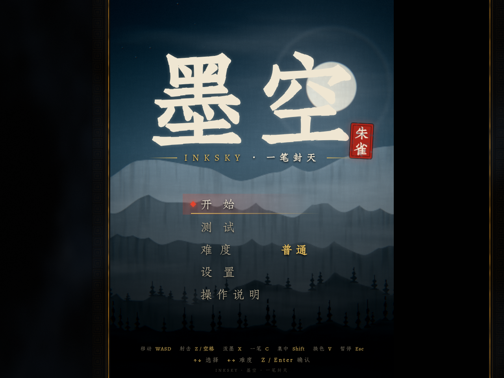
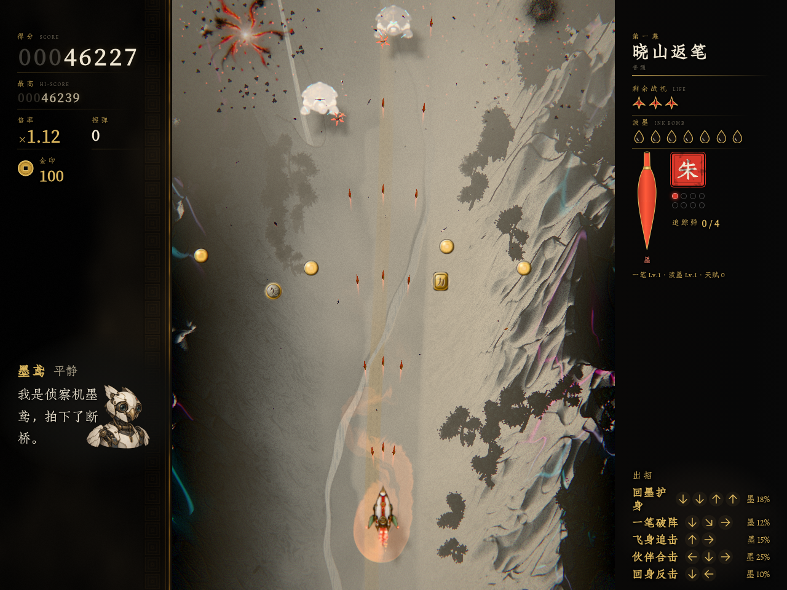
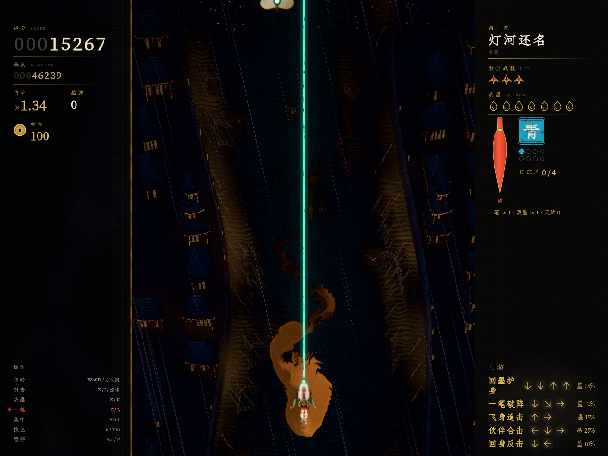
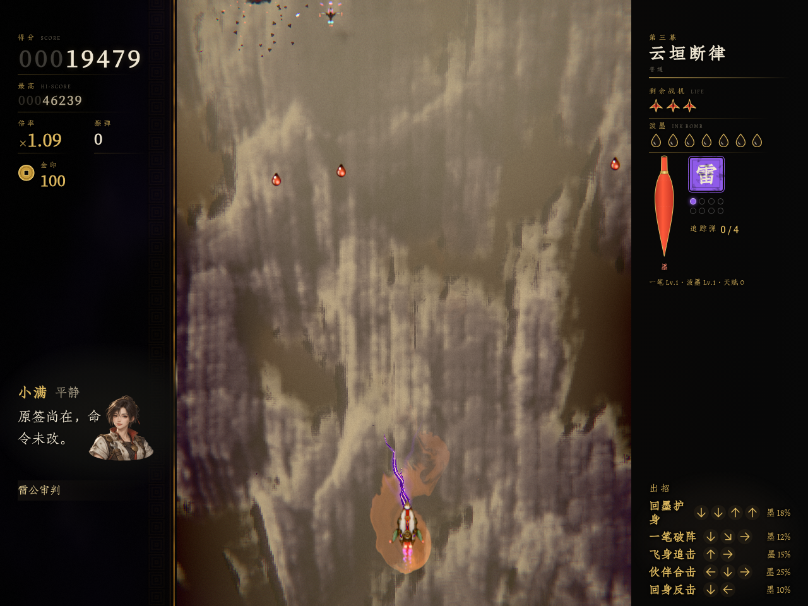

# 墨空 · INKSKYCRAFT

**驾驶朱雀，穿越山水、灯河与云海，以一笔重写天律。**

《墨空》是一款未来科技中式武侠纵版射击游戏。三垣城由墨律维系，失控的天律正在把牺牲变成永久秩序。你与伙伴穿过三幕战场，在弹幕间积墨、出招，取回旧约。



> 当前处于开发阶段。这个仓库持续发布 `v2` 分支的已提交游戏版本；展示录屏使用自动操作和无敌测试模式，适合观察画面与玩法。

## 试玩与视频

- **在线试玩：** Cloudflare Pages 部署准备中，发布后在此更新地址。
- **[观看三章试玩实录 · MP4，约 37 秒，含游戏原声](https://github.com/stofancy/inkskycraft/raw/refs/heads/main/docs/showcase/gameplay.mp4)**
- 录屏包含实际浏览器画面、战斗 HUD、三色武器、自动射击与泼墨。游戏启动时需要加载美术和音频，首次打开请稍候。

## 游戏画面

| 晓山返笔 | 灯河还名 | 云垣断律 |
|---|---|---|
|  |  |  |

原尺寸截图和录制来源见 [展示目录](docs/showcase/) 与 [录制记录](docs/showcase/recording.json)。

## 怎么玩

- **三色武器：** 朱火羽、青玉束、紫金雷刃，战斗中随时切换；拾取同色水晶提升火力。
- **执笔：** 按住画笔键进入子弹时间，移动绘出墨迹，松开后发动笔锋。笔画划过目标形成「斩」，自交闭环形成「封」。
- **泼墨：** 消耗炸弹清理弹幕，打出大范围爆发。
- **成长与补给：** 通过天赋选择、行囊采购、技能和伙伴组合调整打法。
- **伙伴：** 赤燕追击、老盾挡弹、墨鸢缚敌、算盘回墨。
- **三幕战场：** 从山水机关、夜河幻境走向云垣与鲲鹏终战。Boss 有部件、弱点和阶段变化。

### 操作

| 动作 | 键盘 | 标准手柄 |
|---|---|---|
| 移动 | 方向键 / WASD | 左摇杆 / 十字键 |
| 射击（按住） | Z / J / 空格 | A |
| 泼墨 | X / K | B |
| 执笔（按住绘制，松开结算） | C / L | X / RB / RT |
| 切换武器 | V / Tab | Y |
| 主动出招 | 方向指令后按 F / U | 方向指令后按 R3 |
| 精确移动 | Shift | LB / LT |
| 暂停 | Esc / P | Start |

标题页可选择难度、查看操作说明或进入测试模式。主动出招的方向、墨耗与冷却可在暂停菜单查询。浏览器需要先接收一次点击或按键，才能播放声音。

## 本地运行

需要支持 WebGL2 的现代桌面浏览器，以及 Node.js 22.12+ 或 24+。建议开启浏览器硬件加速。

```bash
git clone https://github.com/stofancy/inkskycraft.git
cd inkskycraft
npm ci
npm run dev
```

打开终端提示的本地地址，默认是 `http://127.0.0.1:5173/`。端口已被占用时：

```bash
npm run dev -- --port 5180
```

构建与查看发布版本：

```bash
npm run build
npm run preview
```

构建产物位于 `dist/`，可以部署到 Cloudflare Pages 等静态托管平台。`npm run preview` 默认使用 `http://127.0.0.1:4173/`。

字体子集已随仓库提供，首次试玩和构建可直接使用。需要重新生成字体时，准备 Python 3，再运行：

```bash
npm run fonts:setup
npm run fonts:subset
```

## 自动试玩与录屏

提供可重复执行的浏览器实录机制：[tools/showcase.mjs](tools/showcase.mjs)。它通过测试入口进入三章，用无敌模式和自动操作展示战斗，并录下页面与游戏音频。

需要本机安装 Google Chrome 和 FFmpeg。先运行开发服务，再执行：

```bash
node tools/showcase.mjs http://127.0.0.1:5173/ docs/showcase
```

可通过 `CHROME_PATH`、`FFMPEG_PATH` 指定可执行文件。产物包括标题与三章截图、H.264/AAC 的 `gameplay.mp4`、来源提交与浏览器错误记录。录屏是展示片段，数值平衡和完整通关体验仍在迭代。

## 技术与目录

TypeScript + WebGL2 + Vite。运行时使用原生浏览器图形、音频和输入接口，支持键盘与标准手柄。

| 目录 | 内容 |
|---|---|
| `src/` | 游戏逻辑、关卡、渲染、音频与界面 |
| `public/` | 游戏加载的美术、声音和字体 |
| `assets/fonts/` | 字体来源与许可 |
| `tools/` | 字体构建、预览和录屏工具 |
| `docs/showcase/` | 实际游戏截图、试玩实录与来源记录 |
| `SOURCE.json` | 当前发布版本对应的源分支与提交 |

## 发布与同步

这个仓库使用脱敏后的发布提交。同步进程读取源仓库 `v2` 的已提交内容，在独立发布 worktree 中导出游戏文件、去除本机路径并扫描敏感信息，再推送到 GitHub。

内部制作记录、会话、本机配置、未提交文件和制作中间产物留在本地。源工作区的文件、Git 配置与原始提交保持原状。GitHub 的提交号与源提交号分别记录；历史源提交在初次发布前的内容未上传。

截图与录屏保留各自录制时的源提交，源码同步后不会改写这些记录。

## 素材与授权

字体许可见 [朱雀仿宋 OFL](assets/fonts/Zhuque-OFL.txt) 和 [Noto OFL](assets/fonts/Noto-OFL.txt)。

项目代码与游戏美术、音乐、配音的整体授权尚未声明；公开仓库用于展示和试玩。需要转载、分发或商用时，请先联系作者。第三方字体遵循各自许可。
